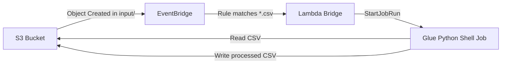

# Infrastructure Design — CSV Processor Pipeline

## AWS Resource Mapping

| Requirement | AWS Resource | CDK Construct | Notes |
|-------------|-------------|---------------|-------|
| FR-1: S3 Bucket | S3 Bucket | `aws_s3.Bucket` (L2) | `event_bridge_enabled=True` |
| FR-2: Glue Job | Glue Python Shell Job | `aws_glue.CfnJob` (L1) | No L2 for Glue jobs; use L1 |
| FR-2: Script | S3 Asset | `aws_s3_assets.Asset` | Deploy script to CDK assets bucket |
| FR-3: EventBridge Rule | EventBridge Rule | `aws_events.Rule` (L2) | Filter on `Object Created` in `input/` |
| FR-4: Lambda Bridge | Lambda Function | `aws_lambda.Function` (L2) | Starts Glue job with S3 key arg |
| IAM: Lambda Role | IAM Role | Auto-created by L2 | + `glue:StartJobRun` policy |
| IAM: Glue Role | IAM Role | `aws_iam.Role` | Trust `glue.amazonaws.com`, S3 access |

## Architecture Diagram



## IAM Design (Least Privilege)

### Lambda Bridge Role
- **Trust**: `lambda.amazonaws.com`
- **Permissions**:
  - `glue:StartJobRun` on the Glue job ARN
  - CloudWatch Logs (auto-granted by CDK L2)

### Glue Job Role
- **Trust**: `glue.amazonaws.com`
- **Permissions**:
  - `s3:GetObject` on `<bucket>/input/*`
  - `s3:PutObject` on `<bucket>/output/*`
  - `s3:GetBucketLocation` on `<bucket>`
  - CloudWatch Logs for Glue job output

## CDK Construct Decisions

1. **S3 Bucket (L2)**: Use `aws_s3.Bucket` with `event_bridge_enabled=True`. No physical name (CDK-generated). `RemovalPolicy.DESTROY` for dev simplicity.

2. **Glue Job (L1 CfnJob)**: No L2 construct exists for Glue jobs. Use `aws_glue.CfnJob` with:
   - `command.name = "pythonshell"`
   - `command.python_version = "3.9"`
   - `command.script_location` → S3 URI from asset deployment
   - `max_capacity = 0.0625` (1/16 DPU, minimum for Python Shell)
   - `glue_version = "3.0"`

3. **Lambda Function (L2)**: Use `aws_lambda.Function` with:
   - Runtime: Python 3.11
   - Memory: 128 MB (minimal — just starts a Glue job)
   - Timeout: 30 seconds
   - Code: inline from `infrastructure/lambda/trigger_glue.py`

4. **EventBridge Rule (L2)**: Use `aws_events.Rule` with:
   - `event_pattern` matching S3 `Object Created` events
   - Filter: `bucket.name`, `key` prefix `input/`, suffix `.csv`
   - Target: Lambda function via `aws_events_targets.LambdaFunction`

5. **S3 Asset**: Use `aws_s3_assets.Asset` to deploy the Glue script. CDK handles upload to the bootstrap bucket and provides the S3 URI.

## File Layout

```
infrastructure/
├── app.py                          # CDK app entry point
├── cdk.json                        # CDK toolkit config
├── requirements.txt                # aws-cdk-lib, constructs
├── stacks/
│   ├── __init__.py
│   └── app_stack.py                # CsvProcessorStack
└── lambda/
    └── trigger_glue.py             # Lambda handler

src/
└── glue_scripts/
    └── process_csv.py              # Glue Python Shell script

pyproject.toml                      # Project deps (dev extras)
tests/
├── __init__.py
└── test_placeholder.py             # Placeholder for CDK assertions
```
