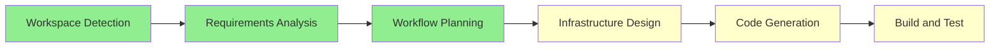

# Workflow Planning — CSV Processor Pipeline

## Execution Plan

This is a single-unit greenfield project. The user explicitly requested mandatory steps only.



## Stage Decisions

| Stage | Decision | Rationale |
|-------|----------|-----------|
| Workspace Detection | EXECUTE | Mandatory — always runs |
| Reverse Engineering | SKIP | Greenfield project |
| Requirements Analysis | EXECUTE (Minimal) | Mandatory — request is clear |
| User Stories | SKIP | Infrastructure-only, no user-facing features |
| Workflow Planning | EXECUTE | Mandatory — always runs |
| Application Design | SKIP | No multi-component design needed |
| Units Generation | SKIP | Single unit of work |
| Functional Design | SKIP | ETL logic is trivial (lowercase + add column) |
| NFR Requirements | SKIP | No NFR constraints specified |
| NFR Design | SKIP | No NFR requirements |
| Infrastructure Design | EXECUTE | AWS resources need CDK mapping |
| Code Generation | EXECUTE | Mandatory — always runs |
| Build and Test | EXECUTE | Mandatory — verify synth works |

## Unit of Work

**Single unit**: `csv-processor-infrastructure`
- S3 bucket (EventBridge enabled)
- Glue Python Shell job + script
- EventBridge rule (S3 Object Created → input/*.csv)
- Lambda bridge function (starts Glue job)
- IAM roles (least-privilege for Lambda and Glue)

## Files to Generate

```
infrastructure/
├── app.py                      # CDK app entry point
├── cdk.json                    # CDK configuration
├── requirements.txt            # CDK Python dependencies
├── stacks/
│   ├── __init__.py
│   └── app_stack.py            # Main stack with all resources
└── lambda/
    └── trigger_glue.py         # Lambda bridge handler

src/
└── glue_scripts/
    └── process_csv.py          # Glue Python Shell script

pyproject.toml                  # Project-level dependencies
tests/
├── __init__.py
└── test_placeholder.py         # Placeholder test
```

## Depth Levels

| Stage | Depth |
|-------|-------|
| Infrastructure Design | Standard — map resources, define IAM boundaries |
| Code Generation | Standard — produce complete, deployable code |
| Build and Test | Minimal — verify `cdk synth` succeeds |
